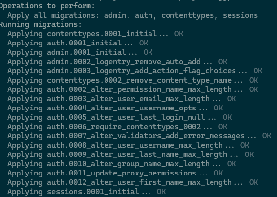
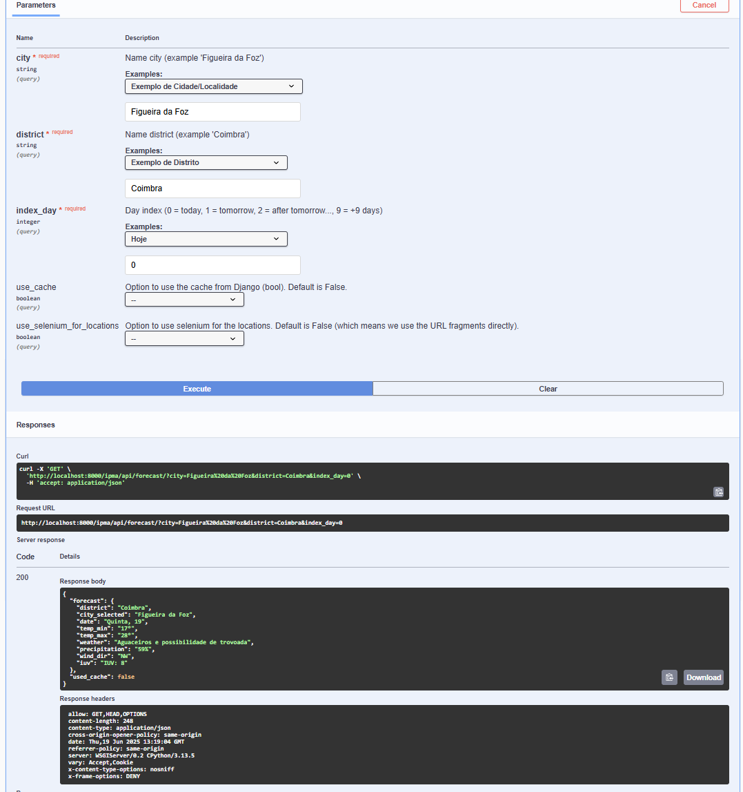
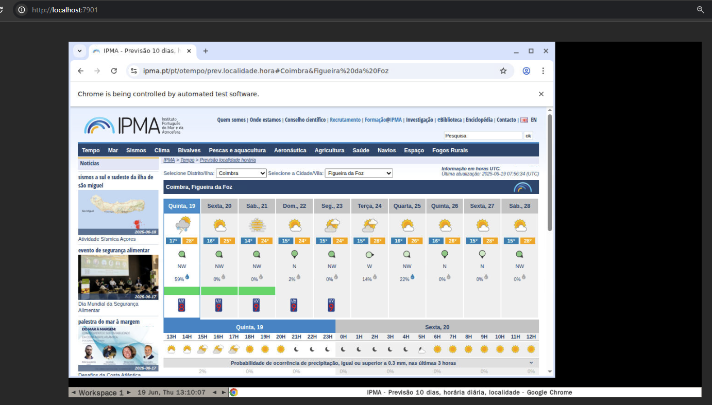

# GGPoker_Test

---

# IPMA Weather Forecast API

Django REST API that scrapes weather forecast data from the IPMA website (https://www.ipma.pt/pt/otempo/prev.localidade.hora/) using Selenium.

---

## Features

- Weather forecast for any district and city in Portugal (with Selenium) for a given day (up to 10d)
- REST API with support for query parameters (`district`, `city`, `index_day`, etc.)
- Optinal: choice between Selenium and URL based scraping (using URL Fragments, faster option)
- Optional caching (Django cache)
- Swagger docs
- Docker (easier setup in any environment)
- noVNC available, to see the Selenium bot in action

---

## Installation steps

Follow these steps to run the project locally using Docker.

NOTE: Docker & Docker compose are needed (tips should come by default with Docker Desktop)

### 1- Github: clone the repo

```bash
git clone https://github.com/Chackoya/GGPoker_Test.git
```

Then go into the project:

```bash
cd GGPoker_Test/
```

---

### 2- Preliminary step .env

Inside the project at root level (same level as manage.py), copy the `.env.example` to `.env`

```bash
cp .env.example .env
```

This `.env` file includes basic environment variables for the project to run.

---

### 3- Build and run the docker containers

Inside the project, with the terminal, run the following commands to start the installation of the project.
It may take a few minutes the first time, especially to download the Selenium image...

```bash
docker compose build
docker compose up
```

This will:

- Build the Django app image
- Set up the PostgreSQL database (NOTE: ended up not being used in the final version of this project)
- Start the Selenium (Chrome) container for webscraping

---

### 4- Run the django migrations

Final step, run the basic Django db migrations by doing the following command (can be in a new terminal):

```bash
docker compose exec gg_django python manage.py migrate

```

NOTE "gg_django" is the docker service name.



After running migrations, it's good to go.

## Access the API

Once the containers are running, the API will be available at:

```
http://localhost:8000/ipma/api/forecast/
```

1. Example 2 - call for a forecast for TODAY (index_day 0) on Coimbra (district), Figueira da Foz (city):

```
http://localhost:8000/ipma/api/forecast/?district=Coimbra&city=Figueira%20da%20Foz&index_day=0
```

2. Example 2 - call for a forecast for AFTER TOMORROW (index_day 2) on Leiria (district), Pombal (city):

```
http://localhost:8000/ipma/api/forecast/?city=Pombal&district=Leiria&index_day=2
```

---

### API Documentation (Swagger UI docs)

Recommended: please check out the swagger doc link below for testing.
The documentation also includes some explanations and details about the query parameters (and other options).

Swagger doc link:

```
http://localhost:8000/api/docs/
```

How to:

- Click on the API for IPMA and click on "Try it out".
- Modify the parameters if needed
- Click on "Execute". The result will appear in the Responses section (check preview image).



### noVNC

It's possible to watch the bot accessing the IPMA website, for that, open the following url: http://localhost:7901/

After opening the url, it's necessary to login, just enter the testing password: "secret".

After that you can watch the Selenium script running (headless=False)



## Notes

- IPMA website only shows weather forecasts up to 9 days in the future.
- If `use_cache=true`, the API will return cached results (15-minute cache window).
- Check out the Swagger doc and the API description for more details about the inputs.
- Project tested on Windows(+WSL) and Linux (Ubuntu), both OK with Docker...

## References:

- Docker config: https://www.docker.com/blog/how-to-dockerize-django-app/
- Django docs.

## Questions

In case of any doubt, problem during installation or question, feel free to reach out to me!
Thanks!
